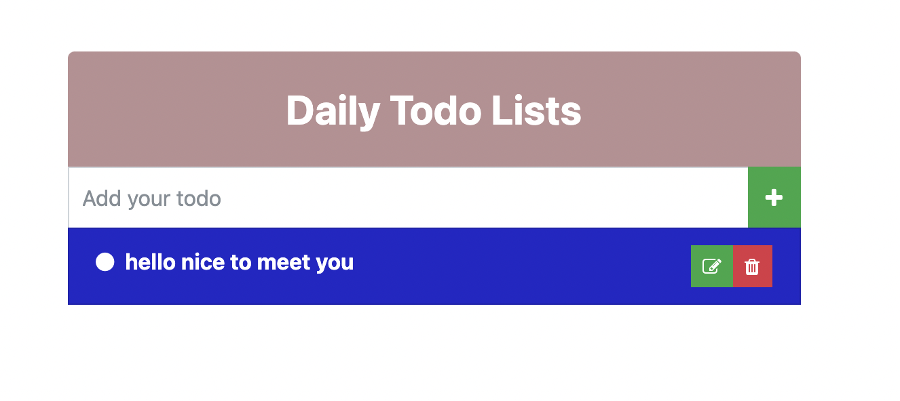

### Learning:
- [x] Creating insert, update, delete to mongodb by go service




### Setup:
Open terminal and type:

```sh
go mod init github.com/lexuanquynh/golang-todo
go get "github.com/go-chi/chi"
go get "github.com/go-chi/chi/middleware"
go get "github.com/thedevsaddam/renderer"
go get "gopkg.in/mgo.v2"
go get "gopkg.in/mgo.v2/bson"
```

you  need install and start mongodb:

```Go
brew tap mongodb/brew
brew install mongodb-community@5.0
brew services start mongodb-community@5.0
```

and run:
```Go
go run main.go  
```